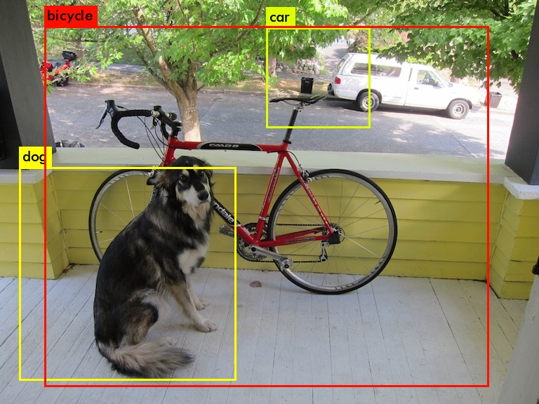

# Custom YOLO trên board DE1-SoC #

## Hướng dẫn build và chạy mô hình trên board DE1-SoC
**Lưu ý:** Linux image của board cần tích hợp các chức năng được đề dưới đây. Tham khảo cách xây dựng linux image cho board SoC-FPGA [tại đây](https://github.com/E-Smartthings/Yocto-Project/tree/linux-socfpga-3.18) và image nhóm đã build cho board DE1-SoC [tại đây](https://drive.google.com/drive/folders/14CX49q9BTDQJo5nZLdxpX3KJViThMZ4x?usp=sharing)
- Intel FPGA SDK for OpenCL
- Thư viện OpenBlas
- Thư viện OpenCV phiên bản 2.4 hoặc thấp hơn (có thể git tại repo của OpenCV [tại đây](https://github.com/opencv/opencv/tree/2.4) hoặc branch [OpenCV-2.4](https://github.com/E-Smartthings/Yocto-Project/tree/OpenCV-2.4) của nhóm đã git về.
- UCV driver nếu muốn tích hợp camera.
- toolchain gcc

Ngoài ra có thể tham khảo bài viết gốc của mô hình custom YOLO tại: https://github.com/k5iogura/darknet_ttt.    
**Lưu ý:** Nếu tham khảo mô hình tại https://github.com/k5iogura/darknet_ttt các bạn hãy xem qua issue của repo, nhóm đã đề cập vấn đề nhóm đã gặp khiến mô hình không hoạt động trên board và cũng như là phương pháp giải quyết.
***
### Biên dịch kernel nhân ma trận GEMM (General Matrix Multiplication)
Tiến hành biên dịch ```gemm_fpga.aocx``` bằng cách sử dụng aoc (altera OpenCL compiler) của Inter FPGA SDK for OpenCL từ kernel source nằm ở đường dẫn ```OpenCL source/OpenCL kernel/gemm_ntt_jikK.cl```.  
Đây là kernel được nạp lên FPGA dùng để thực hiện phép nhân ma trận C = A * B,  
```_ntt_``` có nghĩa ma trận A là rowmajor, B và C là colmajor.  
```_jik```  là thứ tự lặp.  
```K```     là K-line Buffer.

Sử dụng lệnh dưới đây để tạo ra file bit stream cho kernel
$ aoc -fpc -fp-relaxed -v -report ocl/gemm_ntt_jikK.cl -o gemm_fpga.aocx  
```-fp-relaxed``` và `-fpc` option giúp cải thiên tốc độ cho kernel GEMM trên FPGA. Tham khảo thêm [tại đây](https://www.intel.com/content/www/us/en/docs/programmable/683521/22-1/optimizing-floating-point-operations.html)  

Sau khi có được file `gemm_fpga.aocx` copy nó ra thư mục `darknet_ttt`.

**Lưu ý:** cần phải đổi tên file bitstream thành `gemm_fpga.aocx`.
Bên cạnh đó các bạn có thể sử dụng file bitstream nhóm đã biên dịch tại đường dẫn `OpenCL source/Bitstream (Aocx)/gem_half/`
***
### Cài đặt OpenBlas
Tiếp theo ta cần cài đặt gói OpenBLAS lên img của board. Khởi động board có cắm sdcard có chứa linux image và tiến hành cài đặt như sau:                
$ git clone https://github.com/xianyi/OpenBLAS  
$ cd OpenBLAS  
$ make  
$ make PREFIX=/usr/local install

*Lưu ý: Nếu như quá trình cài đặt phiên bản mới nhất cuar OpenBlas bị lỗi thì có thể sử dụng branch [OpenBLAS](https://github.com/E-Smartthings/Yocto-Project/tree/OpenBLAS) của nhóm đã git về để cài đặt*
***
### Biên dịch file thực thi darknet
Tiếp theo ta sử dụng lệnh `Make` để tạo ra file thực thi trên cpu ARM.
Trên board DE1-SoC đã khởi động với linux image ta thực thi các lệnh sau:                            
$ git clone https://github.com/E-Smartthings/Yocto-Project.git   
$ cd Yocto-Project-darknet_ttt  
$ make -f Makefile.self  
Sau đó bạn sẽ tạo ra được file thực thi có tên là `darknet`.
***
### Chạy thử mô hình trên DE1-SoC,  
**Lưu ý:** tên thư mục ở các lênh dưới đây dựa theo image của nhóm, nếu muốn chạy trên image tự build vui lòng đổi tên tương ứng.

Để chạy thử mô hình trên board DE1-SoC đã khởi động với linux image ta thực thi các lệnh sau:    
$ source ./init_opencl.sh  
$ cd darknet_ttt  
$ export LD_LIBRARY_PATH=/usr/local/lib/:$LD_LIBRARY_PATH  
$ aocl program /dev/acl0 gemm_fpga.aocx                     
$ ./darknet detect cfg/ttt5_224_160.cfg weight/ttt5_224_160_last.weights data/dog.jpg  
Kết quả dự đoán trên 1 bức hình của mô hình
                           
  
Để chạy dự đoán trên MP4 Video ta dùng lệnh sau:      
$ ./darknet detector demo cfg/coco.data cfg/ttt5_224_160.cfg weight/ttt5_224_160_last_2.weights data/tokyo.mp4

Đối với camera ta sử dụng lệnh sau:      
$ ./darknet detector demo cfg/coco.data cfg/ttt5_224_160.cfg weight/ttt5_224_160_last_2.weights
***
### Giải thích về mô hình
- Tham khảo thêm tài liệu [tại đây](https://github.com/E-Smartthings/Yocto-Project/blob/darknet_ttt/Doc/18521608_18521613_KLTN.pdf)
